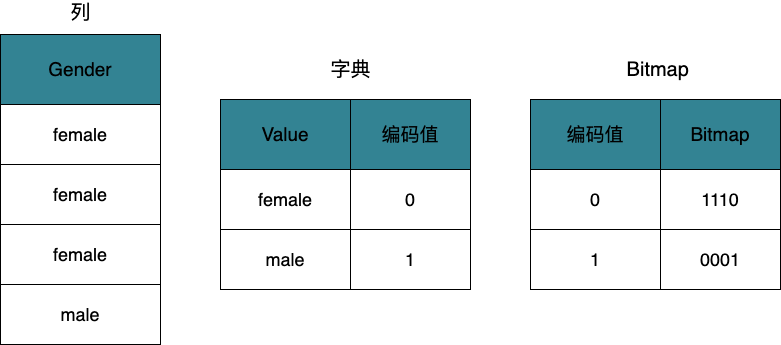

# Bitmap 索引

本文介绍了如何创建和管理 bitmap（位图）索引，以及 bitmap 索引的使用案例。

Bitmap 索引是一种使用 bitmap 的特殊数据库索引。Bitmap 即为一个 bit 数组，一个 bit 的取值有两种：0 或 1。每一个 bit 对应数据表中的一行，并根据该行的取值情况来决定 bit 的取值是 0 还是 1。

Bitmap 索引能够提高指定列的查询效率。如果一个查询条件命中前缀索引列，StarRocks 即可使用[前缀索引](../table_design/Sort_key.md)提高查询效率，快速返回查询结果。但是前缀索引的长度有限，如果想要提高一个非前缀索引列的查询效率，即可以为这一列创建 bitmap 索引。

## 优势

- 如列基数较低，值大量重复，例如 ENUM 类型的列，使用 bitmap 索引能够减少查询的响应时间。如列基数较高，推荐使用 [Bloom filter 索引](../using_starrocks/Bloomfilter_index.md)。
- Bitmap 索引所占的存储空间通常只有索引数据的一小部分，与其他索引技术相比，更节省存储空间。
- 支持为多个列创建 bitmap 索引，提高多列查询的效率，具体参见[多列查询](#多列查询)。

## 使用说明

- Bitmap 索引适用于可使用等值条件 (`=`) 查询或 [NOT] IN 范围查询的列。
- 主键模型和明细模型中所有列都可以创建 bitmap 索引；聚合模型和更新模型中，只有维度列（即 Key 列）支持创建 bitmap 索引。
- 不支持为 FLOAT、DOUBLE、BOOLEAN 和 DECIMAL 类型的列创建 bitmap 索引。
- 如要了解一个查询是否命中了 bitmap 索引，可查看该查询的 Profile 中的 `BitmapIndexFilterRows` 字段。关于如何查看 Profile，参见[分析查询](../administration/Query_planning.md#查看分析-profile)。

## 创建索引

- 建表时创建 bitmap 索引。

    ```SQL
    CREATE TABLE d0.table_hash
    (
        k1 TINYINT,
        k2 DECIMAL(10, 2) DEFAULT "10.5",
        v1 CHAR(10) REPLACE,
        v2 INT SUM,
        INDEX index_name (column_name) USING BITMAP COMMENT ''
    )
    ENGINE = olap
    AGGREGATE KEY(k1, k2)
    DISTRIBUTED BY HASH(k1) BUCKETS 10
    PROPERTIES ("storage_type" = "column");
    ```

    其中有关索引部分参数说明如下：

    | **参数**    | **必选** | **说明**                                                     |
    | ----------- | -------- | ------------------------------------------------------------ |
    | index_name  | 是       | Bitmap 索引名称。                                            |
    | column_name | 是       | 创建 bitmap 索引的列名。您可以指定多个列名，即在建表时可同时为多个列创建 bitmap 索引。|
    | COMMENT     | 否       | 索引备注。                                                   |

    关于建表的其他参数说明，参见 [CREATE TABLE](../sql-reference/sql-statements/data-definition/CREATE%20TABLE.md)。

- 建表后使用 CREATE INDEX 创建 bitmap 索引。详细参数说明和示例，参见 [CREATE INDEX](../sql-reference/sql-statements/data-definition/CREATE%20INDEX.md)。

    ```SQL
    CREATE INDEX index_name ON table_name (column_name) [USING BITMAP] [COMMENT ''];
    ```

## 查看索引

查看指定表的所有 bitmap 索引。详细参数和返回结果说明，参见 [SHOW INDEX](../sql-reference/sql-statements/Administration/SHOW%20INDEX.md)。

```SQL
SHOW { INDEX[ES] | KEY[S] } FROM [db_name.]table_name [FROM db_name];
```

> 说明：创建 bitmap 索引为异步过程，使用如上语句只能查看到已经创建完成的索引。

## 删除索引

删除指定表的 bitmap 索引。详细参数说明和示例，参见 [DROP INDEX](../sql-reference/sql-statements/data-definition/DROP%20INDEX.md)。

```SQL
DROP INDEX index_name ON [db_name.]table_name;
```

## 使用案例

例如，有表 `employee`，其包含了某公司的员工信息。如下展示了表 `employee` 的部分数据。

| **ID** | **Gender** | **Position** | **Income_level** |
| ------ | ---------- | ------------ | ---------------- |
| 01     | female     | Developer    | level_1          |
| 02     | female     | Analyst      | level_2          |
| 03     | female     | Salesman     | level_1          |
| 04     | male       | Accountant   | level_3          |

### **单列查询**

例如，要提高 `Gender` 列的查询效率，即可为该列创建 bitmap 索引。

```SQL
CREATE INDEX index1 ON employee (Gender) USING BITMAP COMMENT 'index1';
```

如上语句执行后，bitmap 索引生成的过程如下：



1. 构建字典：StarRocks 根据 `Gender` 列的取值构建一个字典，将 `female` 和 `male` 分别映射为 INT 类型的编码值：`0` 和 `1`。
2. 生成 bitmap：StarRocks 根据字典的编码值生成 bitmap。因为 `female` 出现在前三行，所以 `female` 的 bitmap 是 `1110`；`male` 出现在第 4 行，所以 `male` 的 bitmap 是 `0001`。

如果想要查找该公司的男性员工，可执行如下语句。

```SQL
SELECT xxx FROM employee WHERE Gender = male;
```

语句执行后，StarRocks 会先查找字典，得到 `male` 的编码值是 `1`，然后再去查找 bitmap，得到 `male`对应的 bitmap 是 `0001`，也就是说只有第 4 行数据符合查询条件。那么 StarRocks 就会跳过前 3 行，只读取第 4 行数据。

### **多列查询**

例如，要提高 `Gender` 和 `Income_level` 列的查询效率，即可为这两列分别创建 bitmap 索引。

- `Gender`

    ```SQL
    CREATE INDEX index1 ON employee (Gender) USING BITMAP COMMENT 'index1';
    ```

- `Income_level`

    ```SQL
    CREATE INDEX index2 ON employee (Income_level) USING BITMAP COMMENT 'index2';
    ```

如上两个语句执行后，bitmap 索引生成的过程如下：


StarRocks 会为 `Gender` 和 `Income_level` 列分别构建一个字典，然后再根据字典生成 bitmap。

- `Gender` 列：`female` 的 bitmap 为 `1110`；`male` 的 bitmap 为 `0001`。
- `Income_level` 列：`level_1` 的 bitmap 为 `1010`；`level_2` 的 bitmap 为 `0100`；`level_3` 的 bitmap 为 `0001`。

如果想要查找工资范围在 `level_1` 的女性员工，可执行如下语句。

```SQL
 SELECT xxx FROM employee 
 WHERE Gender = female AND Income_level = level_1;
```

语句执行后，StarRocks 会同时查找 `Gender` 和 `Income_level` 列的字典，得到以下信息：

- `female`的编码值为`0`，对应的 bitmap 为`1110`；
- `level_1`的编码值为`0`，对应的 bitmap 为`1010`。

因为查询语句中 `Gender = female` 和 `Income_level = Level_1` 这两个条件是 `AND` 关系，所以 StarRocks 会对两个 bitmap 进行位运算 `1110 & 1010`，得到最终结果 `1010`。根据最终结果，StarRocks 只读取第 1 行和第 3 行数据，不会读取所有数据。
